# 카페 메뉴 수는 매출에 영향을 줄까

> 대립가설 **"카페가 운영하는 메뉴 수가 많을수록 매출이 높다"** 를 데이터로 검증한 프로젝트.

한 카페 체인의 거래 로그 15만 건(1부)과 국내 커피 프랜차이즈 20개 브랜드의
공정거래위원회 매출 데이터(2부)를 각각 분석했다. 두 데이터셋 모두 같은 답을 준다 —
**메뉴 수를 늘리는 것은 매출을 끌어올리지 않는다.** 매출을 가르는 것은 방문객 수,
가격 포지셔닝, 매장 포맷이며, 메뉴 수는 매출을 키우는 수단이 아니라 비용을 관리하는 대상이다.

📄 **[통합 리포트 (HTML)](output/report.html)** · 세부 분석은 [`output/`](output) 의 마크다운 문서

---

## 핵심 결과

국내 커피 프랜차이즈 19개 브랜드에서, 브랜드별 **총 메뉴 수**와 **가맹점 평균매출액**의 관계:

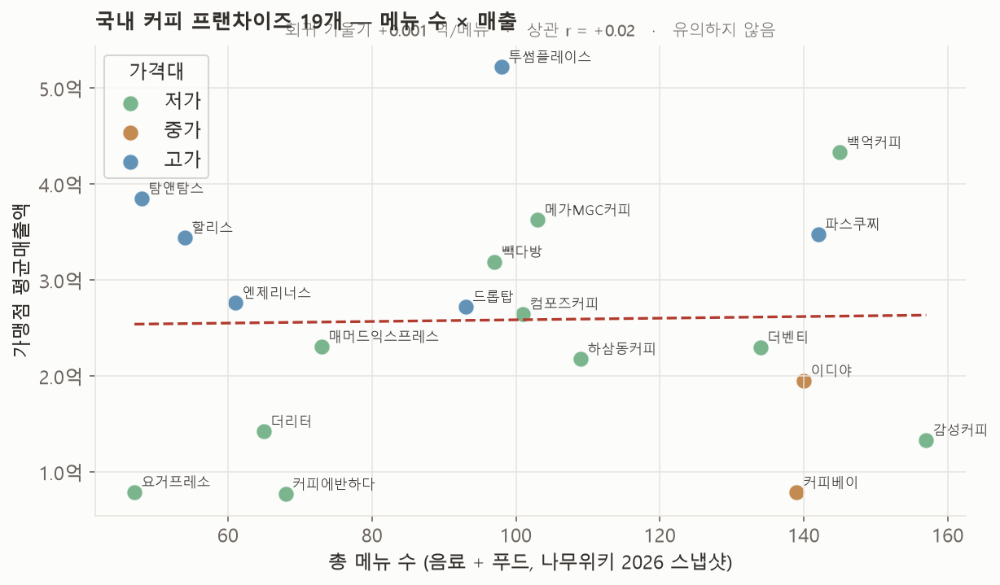

회귀선 기울기 +0.001억/메뉴, 상관계수 r = +0.02. **관계가 없다.**
부트스트랩 95% 신뢰구간 −0.47 ~ +0.49, 어떤 브랜드를 빼도 결과는 −0.1 ~ +0.1을 벗어나지 않는다.

---

## 두 개의 데이터셋

| | 1부 (섹션 1–4) | 2부 (섹션 5) |
|---|---|---|
| 대상 | Maven Roasters (가상 카페 체인, NYC 3개 매장) | 국내 커피 프랜차이즈 20개 브랜드 |
| 기간 | 2023-01 ~ 2023-06 | 2017 ~ 2024 |
| 규모 | 거래아이템 149,116건 · 메뉴 80종 | 브랜드-연도 2,719건 · 커피 브랜드 944개 |
| 매출 출처 | Maven Analytics 공개 데이터 | 공정거래위원회 가맹사업 정보공개서 API |
| 메뉴 수 출처 | 원본에 포함 | 나무위키 브랜드 문서 (2026 스냅샷) |
| 분석 | STL 분해 · 드라이버 회귀 · 합리화 시뮬레이션 · 동등성 검정 | 상관행렬 · 단면 회귀 · 부트스트랩 · 검정력 분석 |

---

## 파이프라인

| 단계 | 내용 | 스크립트 | 산출물 |
|---|---|---|---|
| **1. 수집** | Maven 원본 다운로드 · 공정위 API 8개년 수집 · 나무위키 메뉴 수 집계 · 아메리카노 가격 조사 | `11_fetch_franchise_sales.py` | `data/raw/`, `data/franchise/franchise_all_raw.csv` |
| **2. 전처리** | 날짜·시각 파싱 · `revenue` 파생 · 시간 특성 생성 · 품질 점검 · 브랜드명 정규화 · 패널 구성 | `01_preprocess.py`, `02_eda.py`, `15_menusize_deep.py` | `coffee_clean.parquet`, `store_day/week_panel.csv`, `menusize_panel_v2.csv`, `quality_report.json` |
| **3. 분석** | STL 분해 · 드라이버 회귀 · 매출 분해 · 합리화 시뮬레이션 · 브랜드 단면 회귀 | `03`, `04`, `12`, `15` | `output/*.md`, `output/figures/` |
| **4. 검증** | 내생성 통제 · 부트스트랩 · Leave-one-out · 측정오차 몬테카를로 · 검정력 · 동등성(TOST) | `07_menu_effect_bounds.py`, `15_menusize_deep.py` §D–E | `menu_effect_bounds.md`, `franchise_menusize_deep.md` |
| **5. 전개** | 템플릿 + 그림(base64) 결합 → 단독 HTML 리포트 · GitHub Pages 배포 | `05`, `07_report_figures_p2`, `06_build_report.py` | `output/report.html` |

---

## 전처리

**1부 — `01_preprocess.py`**

- `transaction_date`(`M/D/YY`) + `transaction_time`(`H:MM:SS`) → `transaction_dt` 로 결합
- `revenue = transaction_qty × unit_price` 파생
- 시간 특성 생성: 연·월·ISO주·요일·시간대(daypart)·주말 여부
- 품질 점검: 결측 0건 · 중복 0건 · `unit_price ≤ 0` 0건 · `qty ≤ 0` 0건 → 행 삭제 없이 진행 (`quality_report.json`)
- 집계 패널 3종 구성: 일자(181), 매장 × 일자(543), 매장 × 주(81)

**2부 — `11_fetch_franchise_sales.py`, `15_menusize_deep.py`**

- 공정위 API 응답의 `avrgSlsAmt`(천원 단위) → 억원 변환, `indutyMlsfcNm == "커피"` 로 필터
- 브랜드명 정규화: 영문 병기·표기 변형 통합 (「할리스커피」·「할리스/할리스커피」 → 「할리스」 등)
- 동일 브랜드-연도 중복 행은 가맹점 수가 큰 행을 채택
- 파생 변수: 개점률 · 폐점률 · 푸드 비중 · 매출 CAGR(2020→2024) · 저가 더미(가격 2,500원 미만) · 업력
- 나무위키 메뉴 수는 수동 집계 (HOT/ICED·사이즈 변형 제외, 시즌·단종 항목 제외), 브랜드별 신뢰도 0.55~0.85 로 태깅

---

## 1부 — Maven Roasters: 한 체인의 거래 로그

### 매출은 무엇으로 결정되는가

일매출이 6개월 만에 2배가 됐다. STL로 분해하면 이 변동은 거의 전부 **추세** 성분이다.

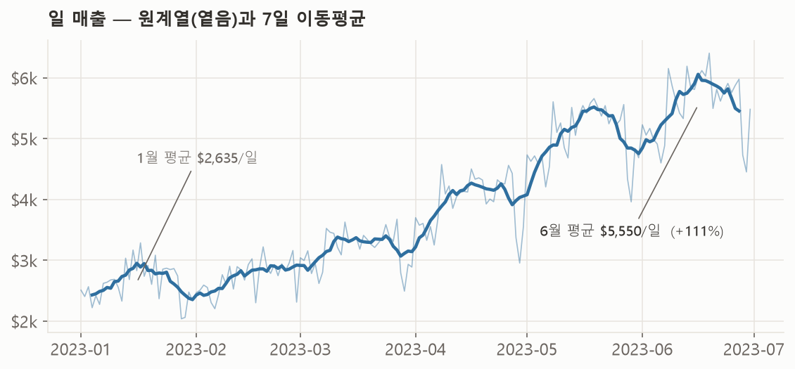
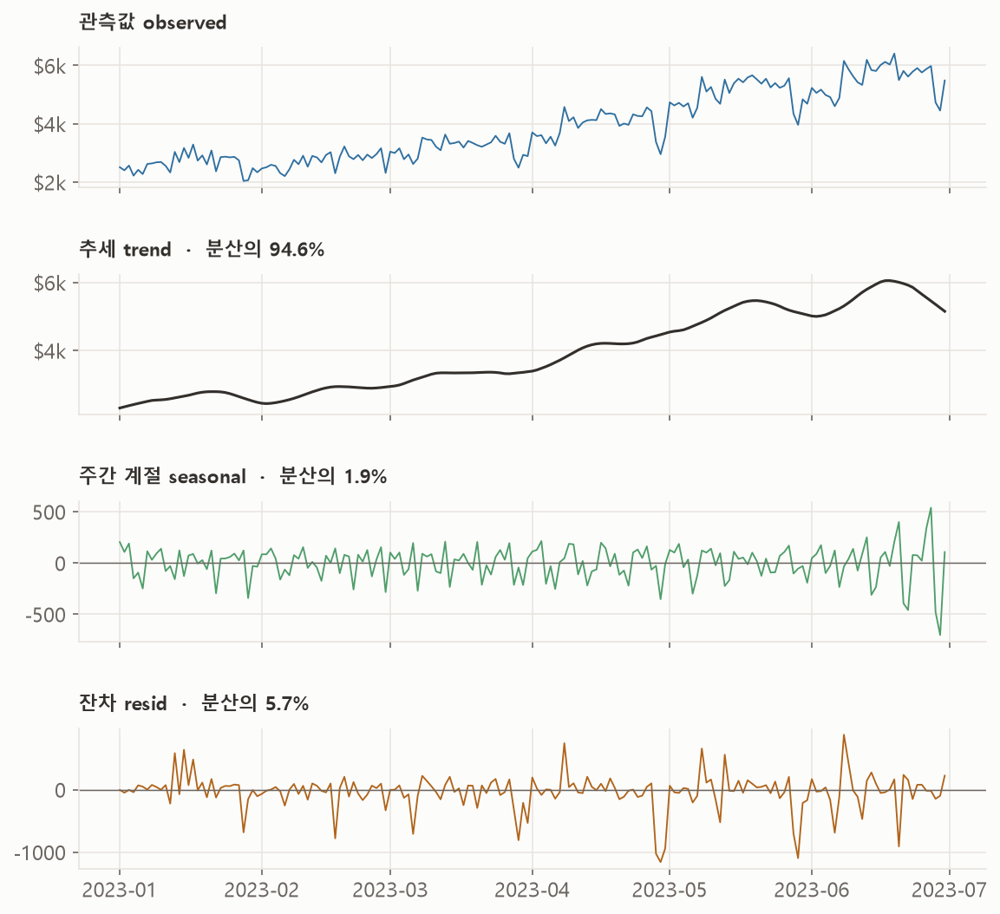

| 성분 | 분산 비중 |
|---|---|
| 추세 (trend) | 94.6% |
| 주간 계절 (seasonal) | 1.9% |
| 잔차 (resid) | 5.7% |

요일 계절성은 진폭 ±$109 (평균의 ±2.8%)로 미미하고, 주중·주말 차이도 없다.

### 그 추세는 무엇으로 설명되나

`log(일매출)`을 매장·요일·시간추세·가격·구성 변수에 회귀하고 변수군을 하나씩 더했다.

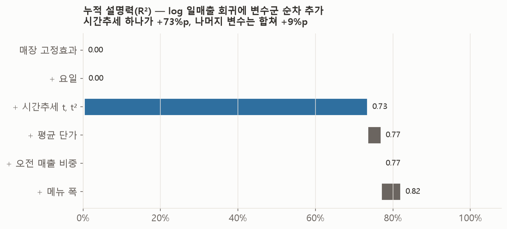

| 추가 변수군 | 누적 R² | 증분 |
|---|---|---|
| 매장 고정효과 | 0.001 | +0.001 |
| + 요일 | 0.002 | +0.001 |
| **+ 시간추세 (t, t²)** | **0.735** | **+0.733** |
| + 평균 단가 | 0.769 | +0.035 |
| + 오전 매출 비중 | 0.769 | +0.000 |
| + 메뉴 폭 | 0.820 | +0.051 |

성장을 `log(매출) = log(거래수) + log(객단가)` 로 분해하면:

| 항목 | 월 성장 기여 |
|---|---|
| 매출 | +11.8% |
| ├ 거래수 (트래픽) | +12.0% |
| └ 객단가 | −0.2% (p = 0.85, 사실상 0) |

성장은 100% 방문/거래 증가에서 나온다.

### 메뉴 폭 계수는 허상이다

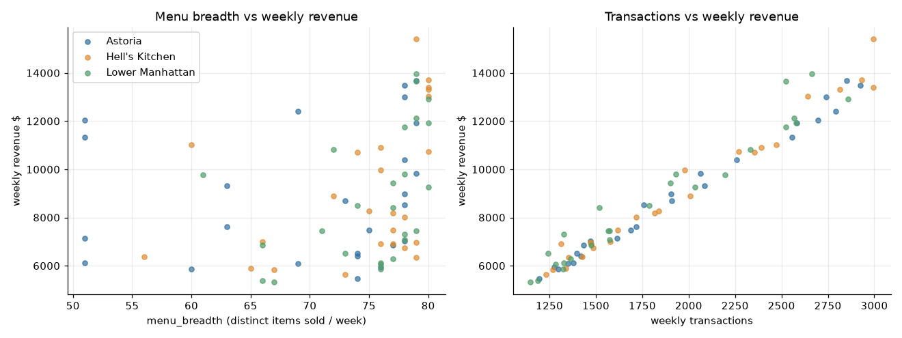

회귀에서 '메뉴 폭'(그 주 팔린 고유 메뉴 수)은 +2.1%/개 (p < 0.001)로 유의해 보이지만,
`log(거래수)`를 통제하면 계수가 −0.05%/개 (p = 0.80)로 사라진다.
"거래가 많은 주일수록 80개 중 더 많은 메뉴가 최소 1개씩 팔린다"는 기계적 상관일 뿐이다.

한계까지 밀어붙인 동등성(TOST) 분석도 같은 결론이다:

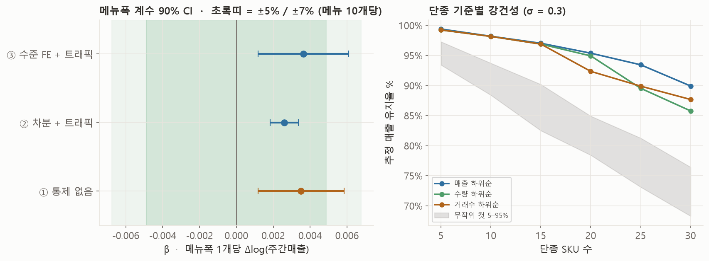

### 메뉴 구성의 구조 (롱테일)

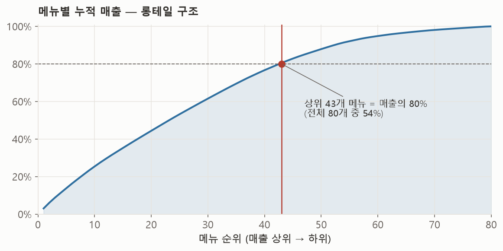
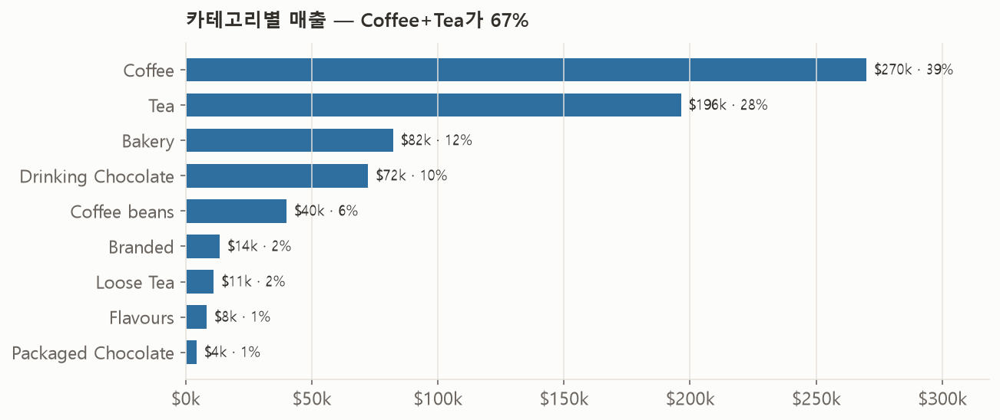

80개 메뉴 중 43개(54%)가 매출의 80%를 만들고, 하위 40개(50%)는 다 합쳐도 23%다.

### 메뉴 합리화 시뮬레이션

하위 매출 순으로 메뉴를 잘라내며, 이탈 수요의 σ 비율이 잔여 메뉴로 이동한다고 가정했다.

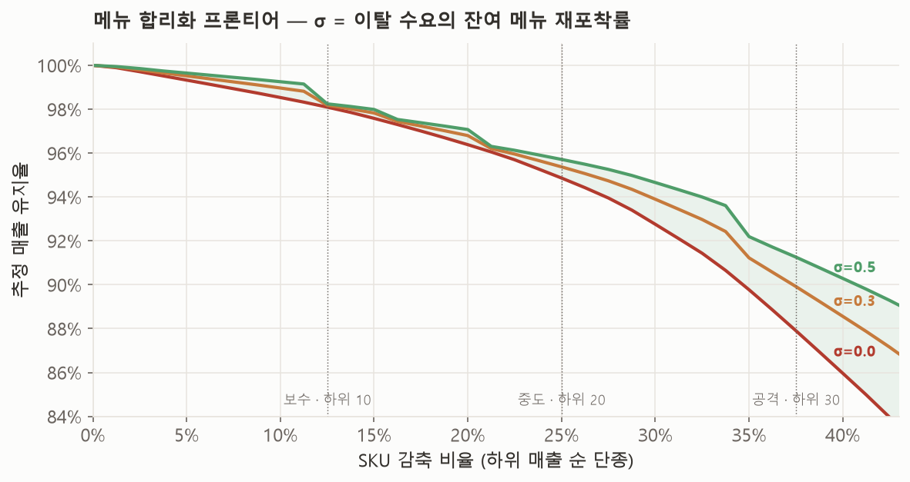

| 시나리오 | 단종 SKU | SKU 감축 | 유지율 σ=0 | σ=0.3 | σ=0.5 |
|---|---|---|---|---|---|
| 보수 (Tier 1) | 10 | −12.5% | 98.1% | 98.2% | 98.2% |
| 중도 (Tier 2) | 20 | −25.0% | 94.9% | 95.4% | 95.7% |
| 공격 (Tier 3) | 30 | −37.5% | 87.9% | 89.9% | 91.3% |

메뉴의 1/8을 없애도 대체 효과 0을 가정해도 매출의 98%가 유지된다.

### 시간대 구조

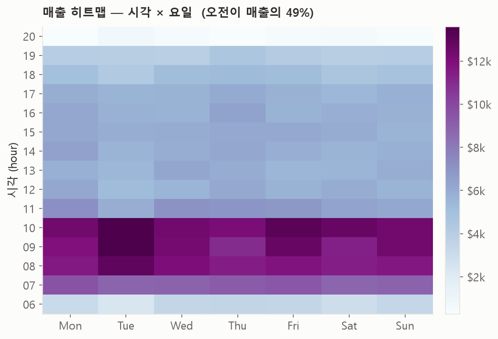

매출의 49%가 오전(06–11시)에 집중된다 — 이건 구조이지 변동 요인이 아니다.

---

## 2부 — 국내 커피 프랜차이즈: 브랜드 간 비교

메뉴 수에 브랜드 간 실제 변이가 생겼다. 47종(요거프레소)부터 157종(감성커피)까지.

### 브랜드 매출·출점 추이

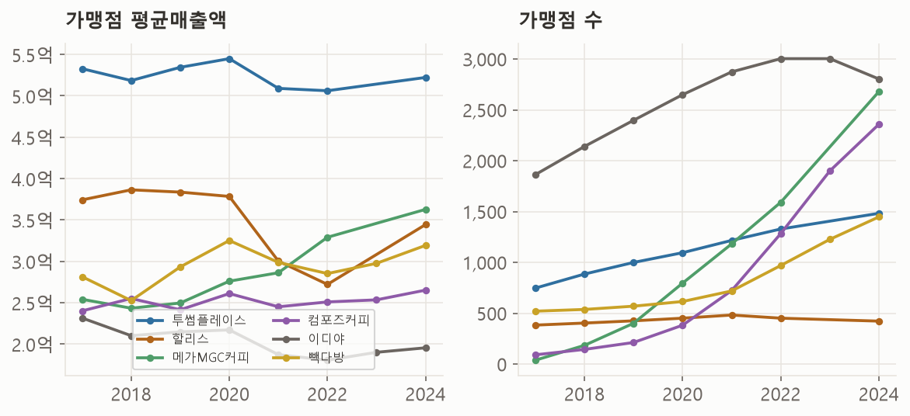

투썸은 가맹점당 5억대를 유지하고, 저가 3사(메가·컴포즈·빽다방)는 매장 수를 폭발적으로
늘리면서도 가맹점당 매출을 지켰다. 이디야는 매출이 하락하며 2023년 첫 순감.

### 메뉴 수 × 매출 (n = 19)

| 브랜드 | 총 메뉴 | 아메리카노 가격 | 가맹점 평균매출 |
|---|---|---|---|
| 투썸플레이스 | 98 | 4,100원 | 5.22억 |
| 백억커피 | 145 | 1,500원 | 4.33억 |
| 탐앤탐스 | 48 | 4,400원 | 3.85억 |
| 메가MGC커피 | 103 | 1,500원 | 3.63억 |
| 파스쿠찌 | 142 | 4,500원 | 3.48억 |
| 할리스 | 54 | 4,500원 | 3.44억 |
| 빽다방 | 97 | 2,000원 | 3.19억 |
| 엔제리너스 | 61 | 4,500원 | 2.76억 |
| 컴포즈커피 | 101 | 1,500원 | 2.65억 |
| 더벤티 | 134 | 1,500원 | 2.30억 |
| 이디야 | 140 | 3,200원 | 1.95억 |
| 요거프레소 | 47 | 2,300원 | 0.79억 |
| 커피베이 | 139 | 3,900원 | 0.79억 |

*(전체 19개 브랜드는 [`data/franchise/menusize_panel_v2.csv`](data/franchise/menusize_panel_v2.csv))*

### 상관행렬

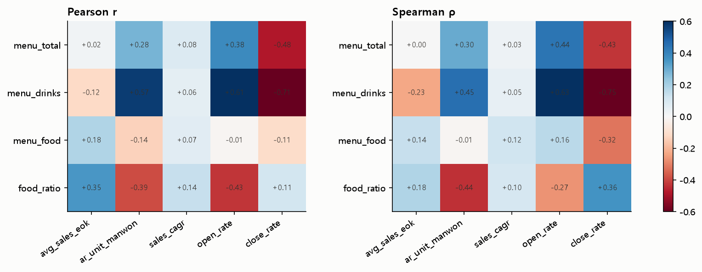

| 메뉴 지표 | Pearson r | Spearman ρ |
|---|---|---|
| 총 메뉴 수 | +0.02 | 0.00 |
| 음료 메뉴 수만 | −0.12 | −0.23 |
| 푸드·디저트 항목 수 | +0.18 | +0.14 |
| 푸드 비중 | +0.35 | +0.18 |

음료 메뉴만 떼면 약한 음(−), 푸드·디저트 항목은 약한 양(+)이다.
가격·매장수·업력을 통제한 회귀 어느 스펙에서도 메뉴 수 계수는 유의하지 않았다 (p 0.58 ~ 0.84).

### 메뉴 규모 3분위별 매출 궤적

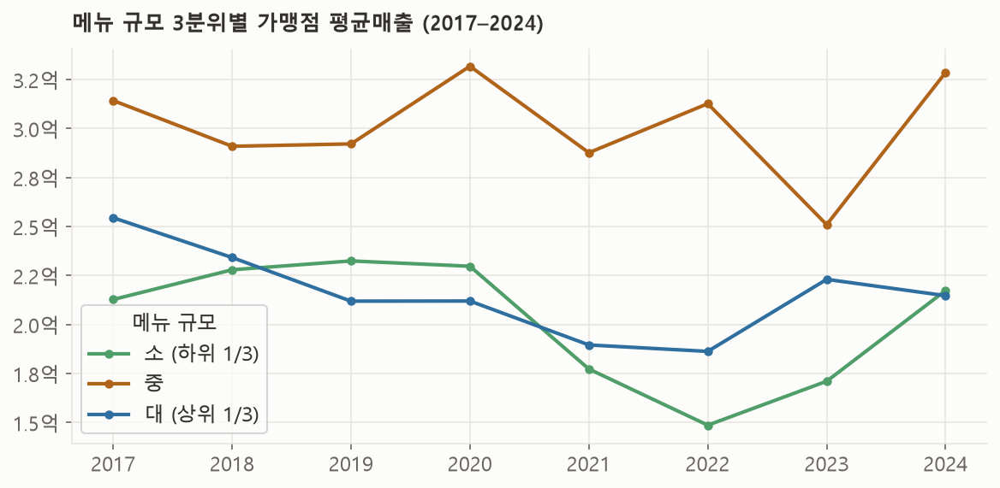

중간 메뉴 규모 그룹이 8년 내내 매출 최고(≈3억), 너무 적거나 많은 그룹은 더 낮다(≈2억).
약한 역U자 힌트 — 다만 분위당 6~7개 브랜드라 확정할 수 없다.

### 왜 저가 브랜드는 메뉴가 가장 많은가

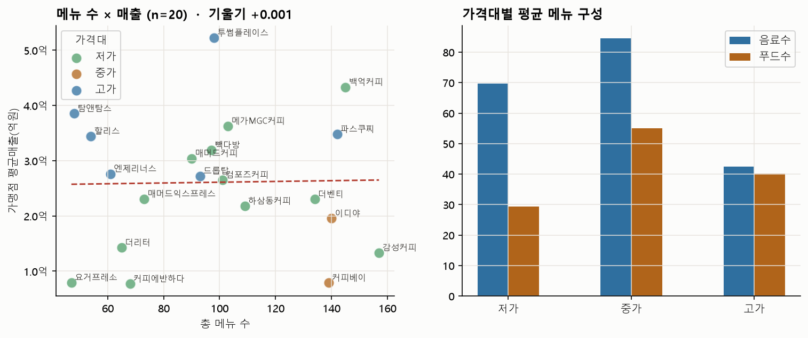

| 가격대 | 브랜드 수 | 평균 음료 수 | 평균 푸드 수 | 평균매출 |
|---|---|---|---|---|
| 저가 (2,500원 미만) | 12 | 70 | 29 | 2.3억 |
| 중가 | 2 | 85 | 55 | 1.4억 |
| 고가 (4,000원 초과) | 6 | 43 | 40 | 3.6억 |

저가 브랜드가 에이드·스무디·빙수로 메뉴 폭을 가장 넓게 가져가지만 가맹점당 매출은 낮다.
많은 메뉴는 저가 박리다매 전략의 부산물이지 매출을 끌어올리는 요인이 아니다.

---

## 결론 — 다섯 갈래의 증거

| 근거 | 설계 | 메뉴 수 효과 |
|---|---|---|
| Maven 매장내 주간 회귀 | store × week, 트래픽 통제 | 계수 0으로 소멸 |
| Maven 합리화 시뮬레이션 | 메뉴 하위 50% 단종 | 매출 77 ~ 88% 유지 |
| Maven 주간매출 분산 분해 | 매장 간 vs 시점 간 | 매장 간(≈메뉴 여지) 0.2% |
| **국내 19개 브랜드 단면** | 가격·매장수 통제 | 총 메뉴 r ≈ 0, 음료 메뉴 r ≈ −0.15 |
| 선택 과부하 문헌 · Simon-Kucher | 실험·산업 벤치마크 | 중앙값 58 SKU 초과 시 매출·만족 하락 |

메뉴 의사결정은 "무엇을 더해야 매출이 오르나"가 아니라
"무엇을 덜어내야 재고·폐기·교육 부담이 주나"의 문제로 다뤄야 한다.

---

## 검증 — 결과가 얼마나 튼튼한가

핵심 결과(메뉴 수 ↔ 매출 관계 없음)를 여러 각도에서 흔들어 봤다.

| 검증 | 방법 | 결과 |
|---|---|---|
| **내생성 통제** | 1부 회귀에 `log(거래수)` 추가 | 메뉴 폭 계수 +2.1%/개 → −0.05%/개 (p = 0.80), 소멸 |
| **부트스트랩 CI** | 4,000회 재표집 | r의 95% 구간 −0.47 ~ +0.49 (0 포함, 유의하지 않음) |
| **Leave-one-out** | 브랜드 1개씩 제외 후 재계산 | r 범위 −0.11 ~ +0.13 — 어느 한 브랜드도 관계를 만들거나 없애지 않음 |
| **측정 오차** | 메뉴 수에 신뢰도 기반 잡음 주입, 1,500회 재적합 | 회귀 계수·상관 중앙값 변화 없음 → 집계 오차와 무관하게 결론 불변 |
| **검정력** | n = 19에서 80% 검정력의 최소 탐지 \|r\| | ≈ 0.60 → 큰 효과(양·음)는 배제, \|r\| < 0.4 는 미결 |
| **동등성 (TOST)** | 1부 메뉴 폭 계수가 ±SESOI 안인지 | "메뉴 10개당 ±7% 초과" 효과는 통계적으로 배제 |
| **다중 성과지표** | 평균매출 외 면적당매출·매출 CAGR로도 회귀 | 어느 지표에서도 메뉴 수 계수 유의하지 않음 |

세부 수치: [`output/menu_effect_bounds.md`](output/menu_effect_bounds.md) ·
[`output/franchise_menusize_deep.md`](output/franchise_menusize_deep.md) (§D 강건성, §E 검정력)

---

## 데이터 출처

| 데이터 | 출처 | 라이선스·비고 |
|---|---|---|
| Coffee Shop Sales | Maven Analytics ([공개 미러](https://github.com/siglimumuni/Datasets/blob/master/Coffee%20Shop%20Sales.csv)) | 학습용 가상 데이터 |
| 브랜드별 가맹점 현황·평균매출 | 공정거래위원회 `FftcBrandFrcsStatsService` ([data.go.kr 15110241](https://www.data.go.kr/data/15110241/openapi.do)) | 무료 API (개발계정 키 필요) |
| 브랜드별 메뉴 수 | 나무위키 각 브랜드 문서 (2026년 스냅샷) | CC BY-NC-SA 2.0 KR |
| 아메리카노 가격 | 커피전문점 가격 조사 (2024.1) | — |
| 스타벅스 프로모션 음료 타임라인 | 나무위키 「스타벅스/메뉴/프로모션 음료」 | 참고 자료 (본 분석 미사용) |

---

## 재현 방법

```bash
pip install pandas numpy matplotlib statsmodels scipy pyarrow tabulate

# --- 1부: Maven Roasters ---
mkdir -p data/raw
curl -L -o data/raw/coffee_shop_sales_raw.csv \
  https://raw.githubusercontent.com/siglimumuni/Datasets/master/Coffee%20Shop%20Sales.csv

python scripts/01_preprocess.py          # 정제 → data/processed/
python scripts/02_eda.py                 # EDA · 패널
python scripts/03_timeseries_drivers.py  # STL · 드라이버 회귀
python scripts/04_menu_rationalization.py # 합리화 시뮬레이션
python scripts/07_menu_effect_bounds.py  # 효과 경계 · 동등성
python scripts/05_report_figures.py      # 리포트 그림

# --- 2부: 국내 프랜차이즈 ---
# data.go.kr 에서 15110241 API 활용신청 → '디코딩' 인증키를
# data/franchise/.apikey 에 한 줄로 저장
python scripts/11_fetch_franchise_sales.py  # 공정위 API 수집
python scripts/12_franchise_eda.py          # 매출·출점 EDA
python scripts/15_menusize_deep.py          # 메뉴 수 심화 단면 분석
python scripts/07_report_figures_p2.py      # 리포트 그림 (2부)

# --- 통합 리포트 빌드 ---
python scripts/06_build_report.py            # → output/report.html
```

`data/raw/`, `data/processed/`, `data/franchise/franchise_all_raw.csv` 는 위 스크립트로 재생성되며
저장소에는 포함하지 않는다 (`.gitignore` 참고).

---

## 전개

`06_build_report.py` 가 `report.template.html` 의 그림 자리표시자를 base64로 치환해
**의존성 없는 단독 HTML** `output/report.html` 을 만든다 (그림 내장, 오프라인 열람 가능).

- **바로 보기** — 저장소에서 [`output/report.html`](output/report.html) 을 내려받아 브라우저로 연다.
- **웹 배포** — Settings → Pages → Branch `main` · `/ (root)` 설정 후
  `https://jwoochoi2001.github.io/DA_Coffee-Menu-Sales-Analysis/output/report.html`
- **재현성** — 모든 그림·표는 `scripts/` 실행으로 재생성된다. 원본 데이터는 `.gitignore` 처리했고
  위 재현 방법으로 복원한다.

---

## 폴더 구조

```
.
├─ README.md                     이 문서
├─ NOTES.md                      작업 로그 (진행 순서·중간 결정)
├─ scripts/
│  ├─ 01_preprocess.py            1부 · 정제 · 파생변수 · 품질점검
│  ├─ 02_eda.py                   1부 · EDA · 패널 구성
│  ├─ 03_timeseries_drivers.py    1부 · STL 분해 · 드라이버 회귀 · 매출 분해
│  ├─ 04_menu_rationalization.py  1부 · 메뉴 합리화 시뮬레이션
│  ├─ 05_report_figures.py        리포트 그림 (1부)
│  ├─ 06_build_report.py          report.template.html → output/report.html
│  ├─ 07_menu_effect_bounds.py    1부 · 효과 경계 · 동등성(TOST) 검정
│  ├─ 07_report_figures_p2.py     리포트 그림 (2부)
│  ├─ 10_build_starbucks_promo_timeline.py  (참고) 스타벅스 프로모션 타임라인
│  ├─ 11_fetch_franchise_sales.py 2부 · 공정위 API 수집
│  ├─ 12_franchise_eda.py         2부 · 매출·출점 EDA
│  ├─ 13_ingest_bigkinds.py       (미사용) 빅카인즈 뉴스 수집 스텁
│  ├─ 14_menusize_vs_sales.py     2부 · 메뉴 수 단면 (1차, n=13)
│  ├─ 15_menusize_deep.py         2부 · 메뉴 수 심화 단면 (n=19, 8단계)
│  └─ report.template.html        리포트 템플릿
├─ data/
│  ├─ processed/quality_report.json
│  └─ franchise/
│     ├─ coffee_brand_panel.csv      공정위 커피 브랜드 패널
│     ├─ menusize_panel_v2.csv       메뉴 수 × 매출 최종 패널
│     ├─ sbux_promo_phases.csv       스타벅스 프로모션 타임라인 (참고)
│     └─ ...
└─ output/
   ├─ report.html                통합 리포트
   ├─ eda_summary.md              1부 · EDA 요약
   ├─ drivers_summary.md          1부 · STL · 회귀
   ├─ menu_rationalization.md     1부 · 합리화 시뮬레이션
   ├─ menu_effect_bounds.md       1부 · 효과 경계
   ├─ franchise_eda.md            2부 · 프랜차이즈 EDA
   ├─ franchise_menusize_deep.md  2부 · 메뉴 수 심화 분석 (8단계)
   ├─ figures/                    분석 그림 22장 (01_ ~ 46_)
   └─ report/                     리포트용 그림 10장 (r_*.png)
```

---

## 한계

**1부 (Maven Roasters)**
- 1거래 = 1품목 구조라 동시 구매(장바구니) 정보가 없다. 교차판매·연관규칙 분석 불가, 합리화 시뮬레이션 유지율은 상한값이다.
- 원가·폐기·인건비 데이터가 없어 매출 기준 분석이다 (이익 아님).
- 6개월·단일 계절 구간의 가상 데이터다.

**2부 (국내 프랜차이즈)**
- n = 19, 단면 분석이라 인과가 아니다. 메뉴 수는 브랜드 전략의 결과이기도 하다 (역인과).
- 메뉴 수는 나무위키 2026 스냅샷 기반이라 ±20 ~ 30% 오차가 있고, 매출(2023–24)과 시점이 어긋난다.
- 정보공개서는 가맹점만 집계해 스타벅스·폴바셋 등 직영 브랜드가 빠졌다.
- 검정력상 n = 19는 |r| ≳ 0.6인 큰 효과만 탐지 가능하다. "메뉴 수가 매출을 좌우한다"는 큰 효과는 배제되지만, 작은 효과(|r| < 0.4)의 존재 여부는 이 표본으로 확정할 수 없다.
